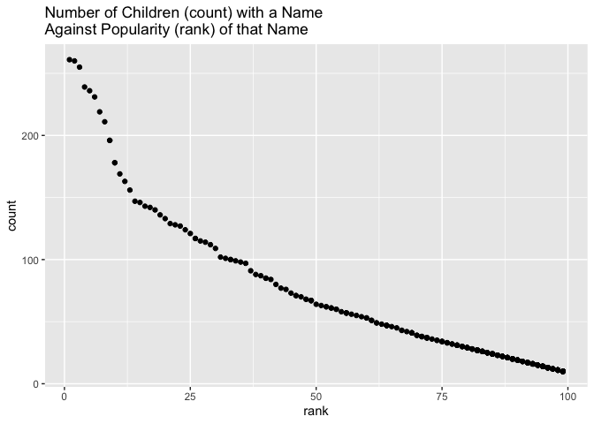

Homework 2 (p8105)
================
Britney Mazzetta (blm2156)

# Problem 1

## Mr. Trash Wheel

``` r
library(tidyverse)
```

    ## ── Attaching packages ───────────────────────────────── tidyverse 1.2.1 ──

    ## ✔ ggplot2 3.2.1     ✔ purrr   0.3.2
    ## ✔ tibble  2.1.3     ✔ dplyr   0.8.3
    ## ✔ tidyr   1.0.0     ✔ stringr 1.4.0
    ## ✔ readr   1.3.1     ✔ forcats 0.4.0

    ## ── Conflicts ──────────────────────────────────── tidyverse_conflicts() ──
    ## ✖ dplyr::filter() masks stats::filter()
    ## ✖ dplyr::lag()    masks stats::lag()

``` r
library(readxl)

prob1 = 
  read_excel("./data/Trash-Wheel-Collection-Totals-8-6-19.xlsx", 
  sheet = 1, range = "A2:N338") %>%
  janitor::clean_names() %>%
  drop_na(dumpster) %>%
  mutate(sport_balls = as.integer(sports_balls)) %>%
  select(-sports_balls)
```

## 2017 Precipitation

``` r
precip2017 = 
  read_excel("./data/Trash-Wheel-Collection-Totals-8-6-19.xlsx", 
  sheet = 6, range = "A2:B14") %>%
  janitor::clean_names() %>%
  mutate(
    Year = 2017
    )
```

## 2018 Precipitation

``` r
precip2018 = 
  read_excel("./data/Trash-Wheel-Collection-Totals-8-6-19.xlsx", 
  sheet = 5, range = "A2:B14") %>%
  janitor::clean_names() %>%
  mutate(
    Year = 2018
    )
```

## Combine Datasets

``` r
combined_data =
  bind_rows(precip2017, precip2018) %>%
  mutate(
    month = as.numeric(month),
    month = month.name[month]
  )
```

## Problem 1 Summary

For this dataset, we are looking at the Mr. Trash Wheel dataset, in
addition to preciptation data for 2017 and 2018. The Mr. Trash Wheel
dataset (prob 1), contains several variables pertaining to specific
dumpsters. Some of these variables include the year and date information
on that dumpster was collected, the weight in tons and volume of the
trash collected in each dumpster, in addition to different types and
their corresponding amounts of trash collected (plastic bottles,
polystyrene, cigarette butts, glass bottles, grocery bags, chip bags,
homes powered, sport balls). The average number of cigarette butts in a
dumpster across the whole dataset was 3.601608410^{4}. The median number
of sports balls in a dumpster in 2017 was 8.

``` r
prob1 %>% 
  filter(year == 2017) %>% 
  summarise(median_balls = median(sport_balls))
```

    ## # A tibble: 1 x 1
    ##   median_balls
    ##          <int>
    ## 1            8

The 2017 Precipiation dataset (precip2017) contains the amount of
rainfall per month in 2017. The median amount of rain in 2017 was 2.145
while the mean amount of rain in 2017 was 2.7441667. The total amount of
precipitation is in 2017 was 32.93.

The 2018 Precipiation dataset (precip2018) contains the amount of
rainfall per month in 2018. The median amount of rain in 2018 was 5.455
while the mean amount of rain in 2018 was 5.8608333. The total amount of
precipitation is in 2018 was 70.33.

The combined dataset (combined\_data) contains the data collected from
both the 2017 Precipitation dataset and the 2018 Precipitation dataset.
There are now 24 rows and 3 columns in the combined dataset. The median
amount of rain in the combined dataset (for years 2017 and 2018) was
4.215 while the mean amount of rain in the combined dataset (for years
2017 and 2018) was 4.3025. The total amount of precipitation in the
combined dataset (for years 2017 and 2018) was 32.93.

# Problem 2

## Pols Data

``` r
pols = 
  read_csv("./data/pols-month.csv") %>%
  janitor::clean_names() %>% 
  separate(mon, c("year", "month", "day"), sep = "-")%>%
  mutate(
    year = as.numeric(year),
    month = as.numeric(month),
    month = month.abb[month],
    month = str_to_lower(month),
    president = ifelse(prez_gop == 1, "gop", "dem") 
  ) %>%
      select(-prez_gop, -prez_dem, -day)
```

    ## Parsed with column specification:
    ## cols(
    ##   mon = col_date(format = ""),
    ##   prez_gop = col_double(),
    ##   gov_gop = col_double(),
    ##   sen_gop = col_double(),
    ##   rep_gop = col_double(),
    ##   prez_dem = col_double(),
    ##   gov_dem = col_double(),
    ##   sen_dem = col_double(),
    ##   rep_dem = col_double()
    ## )

## SNP Data

``` r
snp = 
  read_csv("./data/snp.csv") %>%
  janitor::clean_names() %>% 
  separate(date, c("month", "day", "year"), sep = "/")%>%
 select(year, month, -day, close)%>%
  mutate(
    month = as.numeric(month),
    month = month.abb[month],
    month = str_to_lower(month),
    year = as.numeric(year)
  ) %>%
  arrange(year, month)
```

    ## Parsed with column specification:
    ## cols(
    ##   date = col_character(),
    ##   close = col_double()
    ## )

## Unemployment Data

``` r
unemployment = 
  read_csv("./data/unemployment.csv") %>%
  janitor::clean_names() %>% 
  pivot_longer(
    jan:dec,
    names_to = "month",
    values_to = "unemployment_rate"
  )
```

    ## Parsed with column specification:
    ## cols(
    ##   Year = col_double(),
    ##   Jan = col_double(),
    ##   Feb = col_double(),
    ##   Mar = col_double(),
    ##   Apr = col_double(),
    ##   May = col_double(),
    ##   Jun = col_double(),
    ##   Jul = col_double(),
    ##   Aug = col_double(),
    ##   Sep = col_double(),
    ##   Oct = col_double(),
    ##   Nov = col_double(),
    ##   Dec = col_double()
    ## )

## Joining the datasets

``` r
snp_pols = 
  left_join(pols, snp, by = c("year", "month"))

prob2_full =
  left_join(snp_pols, unemployment, by = c("year", "month"))
```

## Problem 2 Summary

This problem utilized the FiveThirtyEight data. Through this, we looked
at several different datasets: pols data, snp data, unemployment data,
and a combination of data.

The pols data contains 822 observations of 9 variables. These 9
variables indicates whether the president was republican on the
associated date, indicates the number of republican governors, senators,
and representatives on the associated date, in addition to the number of
democratic governors, senators, and representatives on the associated
date. The years for this dataset spanned from 1947 to 2015.

The snp data contains 787 observations of 3 variables related to
Standard & Poor’s stock market index. These 3 variables described the
stock market date observed and the closing values of the S\&P index on
the associated date. The years for this dataset spanned from 1950 to
2015.

The unemployment data contains 816 observations of 3 variables. The
variables described the percentage of unemployment for each of the 12
months in the associated year. The years for this dataset spanned from
1948 to 2015.

The combined dataset (snp\_pols) combined all of the information from
both the pols and snp datasets respectively for the appropriate
corresponding dates. This new dataset had the same number, 822,
observations and an additional variable with 10 total variables.

# Problem 3

``` r
babies_data = read_csv("./data/Popular_Baby_Names.csv") %>%
  distinct() %>%
  janitor::clean_names() %>%
  mutate(ethnicity = recode(ethnicity, "ASIAN AND PACI" = "ASIAN AND PACIFIC ISLANDER", "BLACK NON HISP" = "BLACK NON HISPANIC", "WHITE NON HISP" = "WHITE NON HISPANIC")) %>%
  mutate(ethnicity = str_to_lower(ethnicity), gender = str_to_lower(gender), childs_first_name = str_to_lower(childs_first_name))
```

    ## Parsed with column specification:
    ## cols(
    ##   `Year of Birth` = col_double(),
    ##   Gender = col_character(),
    ##   Ethnicity = col_character(),
    ##   `Child's First Name` = col_character(),
    ##   Count = col_double(),
    ##   Rank = col_double()
    ## )

``` r
babies_data %>%
filter(childs_first_name == "olivia") %>%
  select(-count) %>%
  pivot_wider(names_from = year_of_birth,
      values_from = rank)%>%
  knitr::kable()
```

| gender | ethnicity                  | childs\_first\_name | 2016 | 2015 | 2014 | 2013 | 2012 | 2011 |
| :----- | :------------------------- | :------------------ | ---: | ---: | ---: | ---: | ---: | ---: |
| female | asian and pacific islander | olivia              |    1 |    1 |    1 |    3 |    3 |    4 |
| female | black non hispanic         | olivia              |    8 |    4 |    8 |    6 |    8 |   10 |
| female | hispanic                   | olivia              |   13 |   16 |   16 |   22 |   22 |   18 |
| female | white non hispanic         | olivia              |    1 |    1 |    1 |    1 |    4 |    2 |

``` r
babies_data %>%
filter(gender == "male", rank == 1) %>%
  select(-count) %>%
  pivot_wider(names_from = year_of_birth,
      values_from = rank) %>%
 knitr::kable()
```

| gender | ethnicity                  | childs\_first\_name | 2016 | 2015 | 2014 | 2013 | 2012 | 2011 |
| :----- | :------------------------- | :------------------ | ---: | ---: | ---: | ---: | ---: | ---: |
| male   | asian and pacific islander | ethan               |    1 |   NA |   NA |   NA |   NA |    1 |
| male   | black non hispanic         | noah                |    1 |    1 |   NA |   NA |   NA |   NA |
| male   | hispanic                   | liam                |    1 |    1 |    1 |   NA |   NA |   NA |
| male   | white non hispanic         | joseph              |    1 |   NA |    1 |   NA |    1 |   NA |
| male   | asian and pacific islander | jayden              |   NA |    1 |    1 |    1 |   NA |   NA |
| male   | white non hispanic         | david               |   NA |    1 |   NA |    1 |   NA |   NA |
| male   | black non hispanic         | ethan               |   NA |   NA |    1 |    1 |   NA |   NA |
| male   | hispanic                   | jayden              |   NA |   NA |   NA |    1 |    1 |    1 |
| male   | asian and pacific islander | ryan                |   NA |   NA |   NA |   NA |    1 |   NA |
| male   | black non hispanic         | jayden              |   NA |   NA |   NA |   NA |    1 |    1 |
| male   | white non hispanic         | michael             |   NA |   NA |   NA |   NA |   NA |    1 |

``` r
babies_plot = filter(babies_data, ethnicity == "white non hispanic", year_of_birth == "2016", gender == "male")
ggplot(
  babies_plot, 
  aes(x = rank, y = count)) + 
  geom_point() +
  ggtitle("Number of Children (count) with a Name \nAgainst Popularity (rank) of that Name")
```

<!-- -->
